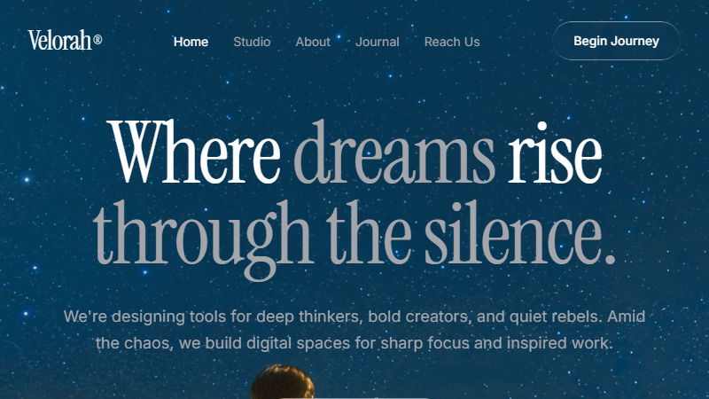
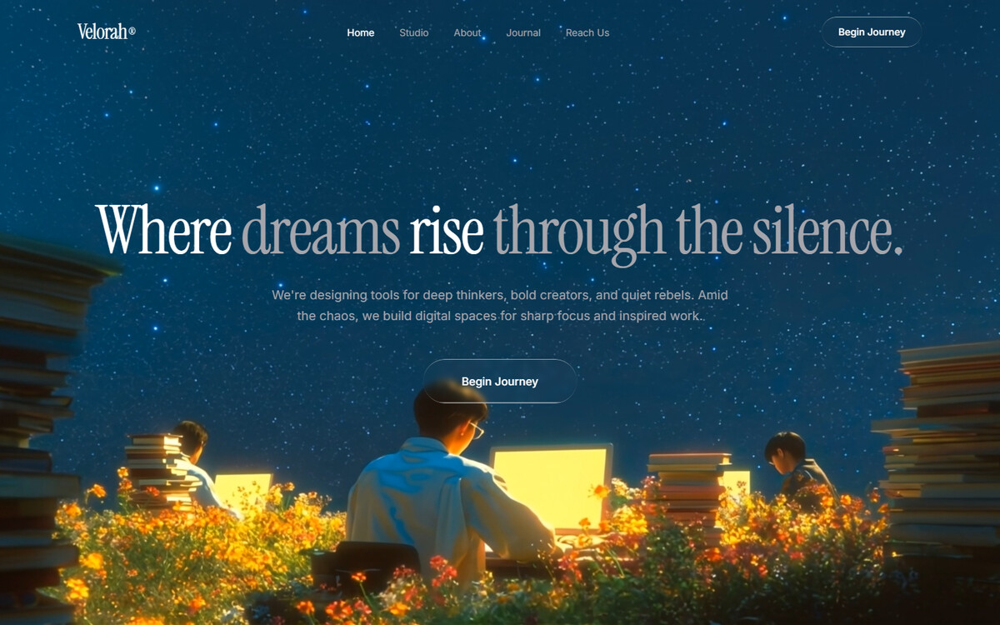
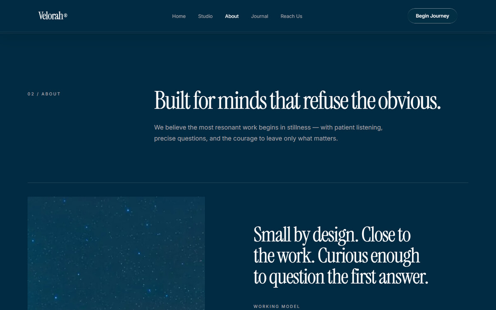
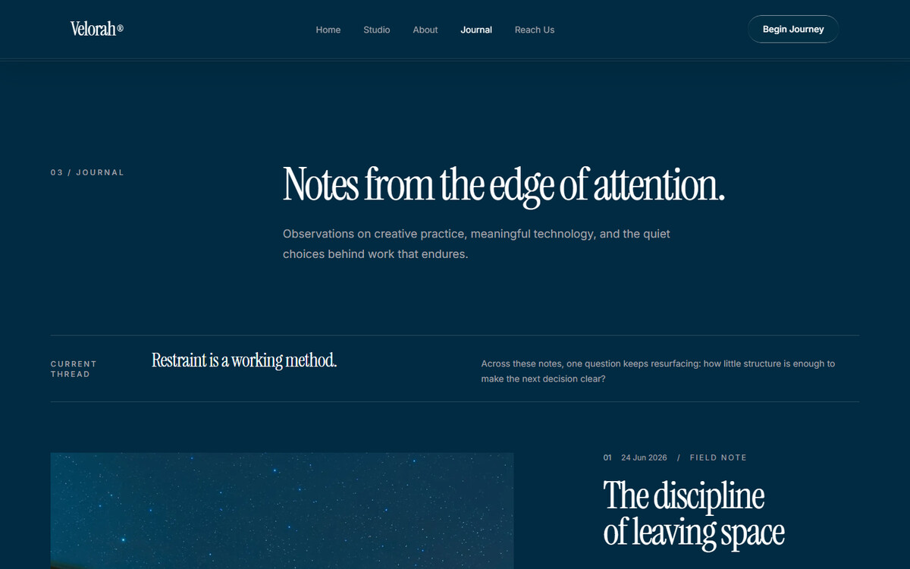
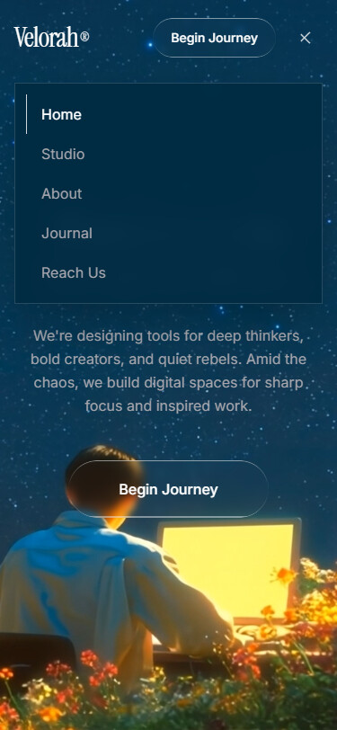
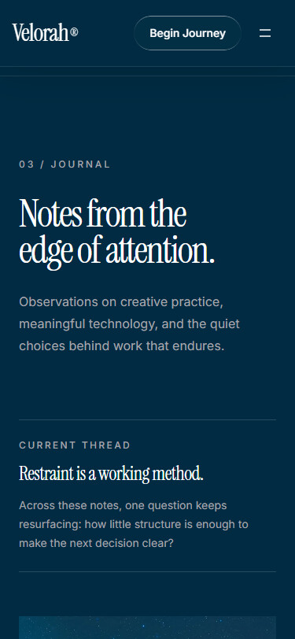

# Velorah Dream

Velorah Dream is a cinematic, production-polished single-page site for an independent creative studio. A fullscreen film opens into an editorial Studio, About manifesto, Journal, direct project invitation, and responsive footer.

[Live site](https://velorah-dream.vercel.app/) · [GitHub repository](https://github.com/JasonTM17/Velorah_Dream) · [Open a project brief](https://github.com/JasonTM17/Velorah_Dream/issues/new?title=Project%20inquiry%3A%20)



## Showcase

### Desktop

| Home | About | Journal |
|---|---|---|
|  |  |  |

### Mobile

| Navigation | Journal |
|---|---|
|  |  |

More motion: [exact hero sequence](./assets/generated/velorah-hero-motion.gif) · [About and Journal walkthrough](./assets/generated/velorah-editorial-sections-motion.gif) · [mobile navigation walkthrough](./assets/generated/velorah-mobile-navigation.gif) · [capture and inspection evidence](./plans/260718-2159-velorah-rich-sections-gif-vercel/reports/gif-evidence-2026-07-19-editorial-refresh.md)

## Quick start

Prerequisite: Node.js `^20.19.0` or `>=22.12.0`.

```bash
npm ci
npm run dev
```

Open the local URL printed by Vite.

## Commands

| Command | Purpose |
|---|---|
| `npm run dev` | Start the Vite development server |
| `npm run build` | Type-check and create the production bundle |
| `npm run preview` | Serve the production bundle locally |
| `npm run lint` | Run ESLint across project TypeScript |
| `npm test` | Run the Vitest component suite once |
| `npm run test:coverage` | Run tests with enforced coverage thresholds |

## Experience

- Native anchors move through Home → Studio → About → Journal → Reach Us. Direct hashes retain 96px fixed-header clearance while layout settles. User input cancels current corrective work; a new hash retargets alignment and starts its own settling cycle. Active state remains correct in short landscape viewports.
- The hero and asymmetric Studio reel share one muted inline MP4. Each attempts playback at 25% visibility, pauses outside view, and contains rejected autoplay promises.
- About combines a manifesto, a three-part Working model, a semantic four-step method with outcomes, and a closing statement.
- Journal presents a Current thread, one featured entry with three visible body paragraphs, two additional notes in native `details` disclosures, and three recurring questions. Each disclosure name includes its note title.
- Below `md`, a 44px menu control opens anchor navigation, focuses Home, and closes on selection, Escape, or desktop resize.
- One-shot section reveals and restrained image/disclosure transitions preserve the cinematic pace. Reduced-motion mode removes CSS entrance, reveal, disclosure, toggle, hover, and smooth-scroll motion; decorative video playback remains enabled.
- Local responsive posters preserve both media compositions when the remote video is delayed or unavailable.
- The project action opens this repository's enabled GitHub Issues channel. The site has no backend, CMS, router, form submission, analytics, or persistent user data.
- A local SVG favicon and 1200×630 PNG provide repository-owned tab and social identity.

## Stack

- React 19 and TypeScript 6
- Vite 8
- Tailwind CSS 4 through the Vite plugin
- shadcn/ui-compatible local `Button` primitive
- Vitest and Testing Library

## Project structure

```text
assets/
|-- generated/                  # Repository motion evidence
`-- images/showcase/            # README still-image gallery
public/
|-- velorah-stills/             # Responsive runtime posters/editorial frames
|-- velorah-mark.svg
|-- velorah-social-card.svg
`-- velorah-social-card.png
src/
|-- components/
|   |-- sections/               # Studio, About, Journal, Reach Us
|   |-- site-header.tsx
|   |-- site-footer.tsx
|   |-- cinematic-image.tsx
|   |-- section-reveal.tsx
|   `-- viewport-video.tsx
|-- content/
|   |-- about-content.ts
|   |-- journal-content.ts
|   |-- site-contact.ts
|   |-- site-media.ts
|   `-- site-navigation.ts
|-- hooks/
|   |-- use-initial-hash-anchor.ts
|   `-- use-page-navigation.ts
|-- app.tsx
|-- index.css
`-- main.tsx
```

The root `assets/` showcase files document the project; runtime media is served from `public/` or the verified remote MP4 origin.

## Documentation

| Document | Purpose |
|---|---|
| [Product requirements](./docs/project-overview-pdr.md) | Scope, acceptance criteria, and boundaries |
| [Codebase summary](./docs/codebase-summary.md) | Current structure and runtime flow |
| [System architecture](./docs/system-architecture.md) | Layers, boundaries, and interaction model |
| [Design guidelines](./docs/design-guidelines.md) | Visual, responsive, motion, and accessibility contracts |
| [Code standards](./docs/code-standards.md) | Implementation and verification conventions |
| [Deployment](./docs/deployment.md) | Vercel release and rollback workflow |
| [Project roadmap](./docs/project-roadmap.md) | Delivered milestone and optional future scope |

## Verification

The current release records 24 passing tests across 6 focused files, enforced coverage thresholds, lint, production build, dependency audit, documentation validation, animated-asset inspection, and Chromium QA at five responsive viewports.

- [Automated verification](./plans/260718-2159-velorah-rich-sections-gif-vercel/reports/tester-2026-07-19-editorial-refresh.md)
- [Browser QA and screenshots](./plans/260718-2159-velorah-rich-sections-gif-vercel/reports/browser-qa-2026-07-19-editorial-refresh.md)
- [Animated GIF evidence](./plans/260718-2159-velorah-rich-sections-gif-vercel/reports/gif-evidence-2026-07-19-editorial-refresh.md)
- [Production-readiness review](./plans/260718-2159-velorah-rich-sections-gif-vercel/reports/code-reviewer-2026-07-19-editorial-refresh.md)
- [Vercel production deployment](./plans/260718-2159-velorah-rich-sections-gif-vercel/reports/deployment-2026-07-19-vercel-production.md)
- [Release journal and lessons](./docs/journals/2026-07-19-velorah-editorial-release.md)

## External media

Hero and Studio use one CloudFront MP4 supplied in the project brief. Google Fonts supplies Instrument Serif and Inter. Canonical and social metadata use the verified Vercel origin and local PNG share card.
